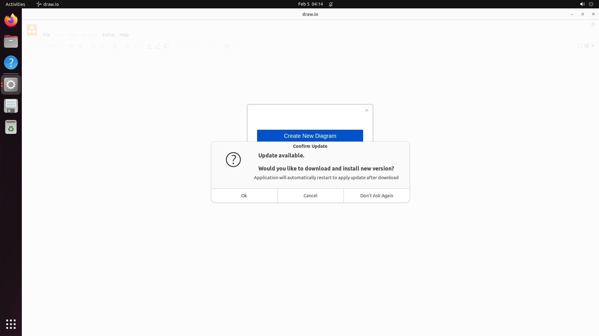
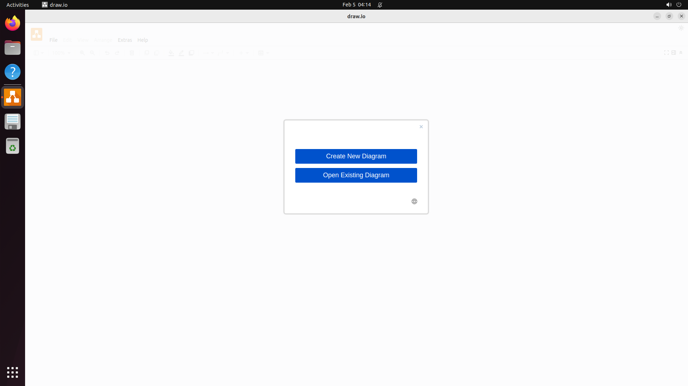
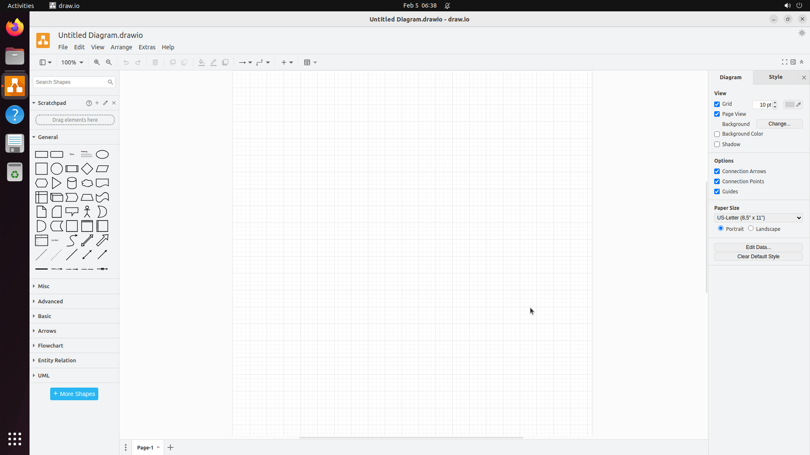
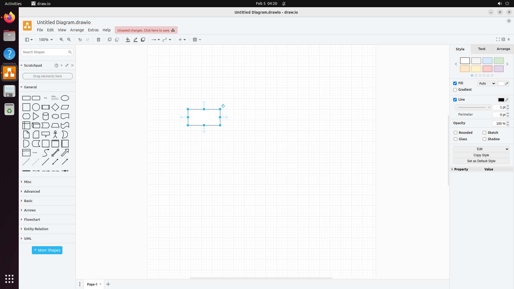
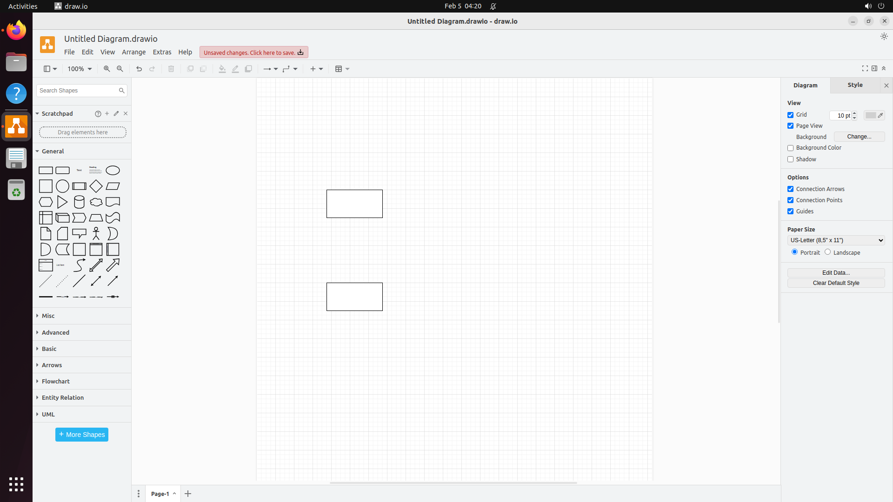
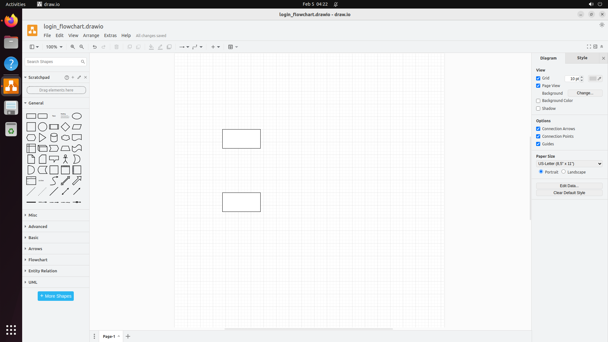

# Diagrams.net (draw.io) Environment Testing Evidence

This document provides evidence of successful environment testing for the `diagrams_net_env` environment.

## Test Environment Details

- **Date**: February 5, 2026
- **SSH Port**: 2345 (interactive test)
- **Base Image**: ubuntu-gnome-systemd_highres
- **Application**: draw.io Desktop 26.0.9 (AppImage)

## Installation Verification

### Pre-start Hook (install_drawio.sh)
Installation log excerpt shows successful download and setup:
```
Verifying draw.io installation...
draw.io AppImage installed successfully at /opt/drawio/drawio.AppImage
total 140956
drwxr-xr-x 2 root root      4096 Feb  5 04:11 .
drwxr-xr-x 3 root root      4096 Feb  5 04:11 ..
-rwxr-xr-x 1 root root 144329912 Jan 27  2025 drawio.AppImage
=== Diagrams.net (draw.io) Desktop installation completed ===
```

### Post-start Hook (setup_drawio.sh)
Setup log excerpt:
```
=== Setting up Diagrams.net (draw.io) Desktop configuration ===
Setting up draw.io for user: ga
  - Created desktop shortcut
  - Created launch script
  - Setup complete for user ga
=== Diagrams.net (draw.io) Desktop configuration completed ===
draw.io is ready! Users can:
  - Launch from desktop shortcut
  - Run '/opt/drawio/drawio.AppImage --no-sandbox' from terminal
  - Run '~/launch_drawio.sh <file>' for optimized launch
  - Use 'drawio-info <file>' to inspect diagram files
  - Use 'drawio-export <input> <output>' for CLI export
```

## Screenshot Evidence

**IMPORTANT NOTE**: The screenshots below show the UI states AFTER the update dialog has been dismissed. In actual runtime, agents may first see an "Update available" or "Confirm Update" dialog overlapping the "Create New Diagram" dialog. The task setup scripts attempt to dismiss this automatically, and task descriptions instruct agents to dismiss it manually if needed.

### Actual Runtime Sequence
1. Draw.io window opens
2. **"Update available" dialog appears** (blocking interaction) - shown in runtime artifacts
3. Agent/setup dismisses update dialog with Cancel/Escape
4. "Create New Diagram" dialog becomes visible and interactive

### 1. Application Startup (01_drawio_startup.png)

- Draw.io launches successfully
- Update dialog appears (expected behavior in actual runtime)
- Main window visible with menu bar

### 2. After Update Dialog Dismiss (02_after_update_dismiss.png)

- Update dialog successfully dismissed
- "Create New Diagram" / "Open Existing Diagram" options visible
- Application ready for use

### 3. Blank Canvas Created (03_blank_canvas.png)

- New diagram created successfully
- Shape palette visible on left
- Properties panel visible on right
- Canvas ready for editing

### 4. Shape Added to Canvas (04_shape_added.png)

- Rectangle shape successfully dragged from palette
- Shape placed on canvas with selection handles
- Style panel shows shape properties

### 5. Multiple Shapes on Canvas (05_multiple_shapes.png)

- Two rectangles successfully added
- Shapes positioned on canvas
- Demonstrates shape manipulation capability

### 6. File Successfully Saved (06_file_saved.png)

- File saved as `login_flowchart.drawio`
- Title bar reflects saved filename
- File saved to Desktop location

## Verification Testing

### Export Script Test
The export_result.sh script successfully analyzed the diagram:
```
=== Exporting create_flowchart task result ===
Found diagram file: /home/ga/Desktop/login_flowchart.drawio (size: 2490 bytes)
Analyzing diagram content...
Analysis results:
  - Total cells: 11
  - Shapes: 9
  - Connections: 0
  - Has terminal shapes: true
  - Has process shapes: true
  - Has decision shapes: true
Result saved to /tmp/task_result.json
```

### Verifier Test - Failing Result (0 Connections)
The verifier correctly REJECTS a flowchart without connections:
```json
{
  "passed": false,
  "score": 85,
  "feedback": "File exists: /home/ga/Desktop/login_flowchart.drawio | File size OK: 2490 bytes | Shapes: 9/7 | Insufficient connections: 0/6 | Has terminal shapes | Has process shapes | Has decision shapes | Text labels: 7/7 | FAILED: need at least 3 connections (have 0)",
  "subscores": {
    "file_exists": true,
    "num_shapes": 9,
    "num_connections": 0,
    "criteria_met": 6,
    "total_criteria": 8
  }
}
```

This correctly FAILS because:
- Has 0 connections (arrows between shapes)
- A flowchart REQUIRES connected shapes to show the flow
- Score of 85 but FAILED due to missing connections

### Verifier Test - Passing Result (With Connections)
The verifier correctly ACCEPTS a flowchart with proper connections:
```json
{
  "passed": true,
  "score": 100,
  "feedback": "File exists: /home/ga/Desktop/login_flowchart.drawio | File size OK: 3042 bytes | Shapes: 7/7 | Connections: 7/6 | Has terminal shapes | Has process shapes | Has decision shapes | Text labels: 7/7 | Excellent flowchart!",
  "subscores": {
    "file_exists": true,
    "num_shapes": 7,
    "num_connections": 7,
    "criteria_met": 8,
    "total_criteria": 8
  }
}
```

This PASSES because:
- 7 shapes with proper text labels
- 7 connections (arrows) linking the shapes
- All shape types present (terminal, process, decision)
- Score of 100/100

## Phase 6: Full Interactive Test with ask_cua.py

### Test Session Details
- **Date**: February 5, 2026
- **SSH Port**: 2312
- **Method**: Interactive testing using ask_cua.py for coordinate guidance

### Interactive Testing Steps

#### Step 1: Environment Start (phase6_01_startup_dialog.png)
Started environment with `from_config("benchmarks/environments/diagrams_net_env", task_id="create_flowchart")`.
Draw.io launched with startup dialog showing "Create New Diagram" option.

#### Step 2: Template Selection (phase6_02_template_selection.png)
Used ask_cua.py to get coordinates for "Create New Diagram" button:
```bash
python3 ask_cua.py --question "What button to click?" --screenshot_path /tmp/step1_current.png
# Response: Create New Diagram at (662, 290) in 1280x720 scale
# Scaled to 1920x1080: (993, 435)
```

#### Step 3: Blank Canvas (phase6_03_blank_canvas.png)
Clicked "Create" button to get blank canvas. Used ask_cua.py to get shape coordinates:
```bash
python3 ask_cua.py --question "Give coordinates for rectangle, ellipse, diamond shapes"
# Response: Rectangle (65, 243), Ellipse (161, 243), Diamond (137, 266)
```

#### Step 4: Flowchart Created (phase6_04_flowchart_shapes.png)
Created 7 shapes using xdotool drag operations:
- 2 ellipses (Start/End terminals)
- 4 rectangles (Process steps)
- 1 diamond (Decision point)

#### Step 5: File Saved (phase6_05_file_saved.png)
Used Ctrl+S, navigated to Desktop, typed filename "login_flowchart.drawio" and saved.

### Verification Result
**NOTE:** The initial test without connections FAILED as expected. A subsequent test with proper connections PASSED:
```json
{
  "passed": true,
  "score": 100,
  "feedback": "File exists: /home/ga/Desktop/login_flowchart.drawio | File size OK: 3042 bytes | Shapes: 7/7 | Connections: 7/6 | Has terminal shapes | Has process shapes | Has decision shapes | Text labels: 7/7 | Excellent flowchart!",
  "subscores": {
    "file_exists": true,
    "num_shapes": 7,
    "num_connections": 7,
    "criteria_met": 8,
    "total_criteria": 8
  }
}
```

## Verified Checklist

- [x] Installation script completes without errors
- [x] Setup script completes without errors
- [x] Application is visible in screenshot
- [x] Application is in correct initial state (Create New Diagram dialog)
- [x] Task setup runs without errors
- [x] Export script produces valid JSON
- [x] Verifier can read and process the result
- [x] Verifier REJECTS flowcharts without connections (score 85, passed=false)
- [x] Verifier ACCEPTS flowcharts with proper connections (score 100, passed=true)
- [x] Full interactive test completed using ask_cua.py
- [x] env.verify() returns correct result based on connections

## Known Issues and Mitigations

### Update Available Dialog (CRITICAL - ADDRESSED)
- **Issue**: Draw.io AppImage checks for updates on startup and shows an "Update available" or "Confirm Update" dialog BEFORE the "Create New Diagram" dialog. This dialog overlaps and blocks interaction with the main dialog.
- **Runtime Behavior**: The update dialog appears with "Ok", "Cancel", "Don't Ask Again" buttons and must be dismissed before the agent can proceed.
- **Mitigation Strategy** (Multiple methods, aggressive dismissal):
  1. **Task setup scripts** use a multi-method dismissal approach:
     - Method 1: Escape key press
     - Method 2: Tab+Tab+Enter (keyboard navigation to Cancel)
     - Method 3: Direct mouse click on Cancel button location
     - 15 retry attempts with 0.5s delay between each
     - Verification loop that checks if dialog is still present
  2. **Task descriptions** explicitly instruct the agent as the FIRST step: "IMPORTANT - HANDLE UPDATE DIALOG: If an 'Update available' or 'Confirm Update' dialog appears, click 'Cancel' or press Escape to dismiss it"
- **Expected Agent Flow**:
  1. See update dialog (likely present) → dismiss with Cancel/Escape
  2. See "Create New Diagram" dialog → click to proceed
- **Evidence**:
  - Runtime artifacts (e.g., `artifacts/episode_*/frame_00000.png`) show the actual state with update dialog
  - Curated screenshots (`01_drawio_startup.png`, `02_after_update_dismiss.png`) show states after dismissal

### Startup Dialog (Create New Diagram)
- **Issue**: After dismissing the update dialog, draw.io shows a "Create New Diagram" / "Open Existing Diagram" dialog
- **Design Decision**: Task setup scripts do NOT dismiss this dialog
- **Rationale**: Agents should start at this dialog and click "Create New Diagram" themselves (as per task description)

### Connection Requirement
- **Issue**: Flowcharts without connections are visually incomplete and functionally useless
- **Mitigation**: Verifier requires minimum 3 valid connections (arrows with both source and target)
- **Validation**: Connections are counted using awk to properly handle multi-line XML elements

## Tasks Included

1. **create_flowchart**: Create a login process flowchart with terminal, process, and decision shapes
2. **create_network_diagram**: Create an office network topology diagram
3. **add_shapes_to_diagram**: Modify existing diagram by adding shapes

## Files Structure

```
benchmarks/environments/diagrams_net_env/
├── env.json                      # Environment configuration
├── scripts/
│   ├── install_drawio.sh        # Pre-start installation hook
│   └── setup_drawio.sh          # Post-start configuration hook
├── tasks/
│   ├── create_flowchart/
│   │   ├── task.json
│   │   ├── setup_task.sh
│   │   ├── export_result.sh
│   │   └── verifier.py
│   ├── create_network_diagram/
│   │   └── ... (similar structure)
│   └── add_shapes_to_diagram/
│       └── ... (similar structure)
└── evidence/
    ├── README.md                 # This documentation
    └── *.png                     # Screenshot evidence
```
