# NOSH ChartingSystem Environment — Evidence Documentation

## Verification Date
2026-02-22

## Environment Summary
- **App**: NOSH ChartingSystem 2.0 (nosh2) — open-source EHR built on Laravel 5/PHP 7.4
- **Docker stack**: shihjay2/nosh2:latest (PHP-FPM:9000) + mariadb:10.11 + nginx:alpine
- **Login URL**: `http://localhost/login`
- **Admin credentials**: `admin` / `Admin1234!`
- **Provider credentials**: `demo_provider` / `Provider1234!`
- **Practice**: Hillside Family Medicine (practice_id=1)
- **Patients**: 20 Synthea synthetic patients (PIDs 1-20)

## Task Start State

All 10 tasks start from the **NOSH login page** (`http://localhost/login`). Each `setup_task.sh` hook kills Firefox and relaunches it at the login URL.

**Credentials by task type:**
- **Clinical chart tasks** (add_allergy, add_immunization, add_medication, add_medical_problem, create_encounter, document_vitals, schedule_appointment, update_demographics): log in as `demo_provider` / `Provider1234!` — the "+" add buttons in patient chart sections are only visible to users with group_id=2 (provider), NOT admin (group_id=1)
- **Practice management tasks** (add_provider, register_new_patient): log in as `admin` / `Admin1234!`

## Key Navigation Routes

| Route | Description |
|-------|-------------|
| `GET /login` | Login page (start state for all tasks) |
| `GET /add_patient` | Add New Patient form |
| `GET /set_patient/{pid}` | Set current patient in session |
| `GET /patient` | Patient chart main page (sidebar with all sections) |
| `GET /demographics` | Demographics section |
| `GET /allergies_list/list` | Allergies section |
| `GET /medications_list/active` | Medications section |
| `GET /immunizations_list` | Immunizations section |
| `GET /conditions_list/active` | Conditions/Problems section |
| `GET /encounters_list` | Encounters list |
| `GET /schedule/{provider_id?}` | Schedule/calendar |
| `GET /users/2/1` | Users management (type=2 providers, active=1) |

## Screenshots

### 01–06: Early Exploratory Testing
Initial screenshots from the first interactive testing session showing login, dashboard, patient chart, and demographics loading after fixes were applied.

| File | Description |
|------|-------------|
| `01_login_page.png` | Initial NOSH login page |
| `02_login_page_final.png` | Login page confirmed after Firefox profile fix |
| `03_dashboard.png` | NOSH dashboard after successful login |
| `04_add_patient_form.png` | Add New Patient form at `/add_patient` |
| `05_patient_chart.png` | Patient chart with full sidebar (Tracey Crona) |
| `06_patient_demographics.png` | Demographics page after sex-field and scans-dir fixes |

---

### 07: Login Page — Task Start State (All Tasks)

**File**: `07_login_page.png` | **URL**: `http://localhost/login`

Clean login page (not authenticated). Username/password fields, practice dropdown showing "Hillside Family Medicine", Login button. This is the confirmed start state for every task.

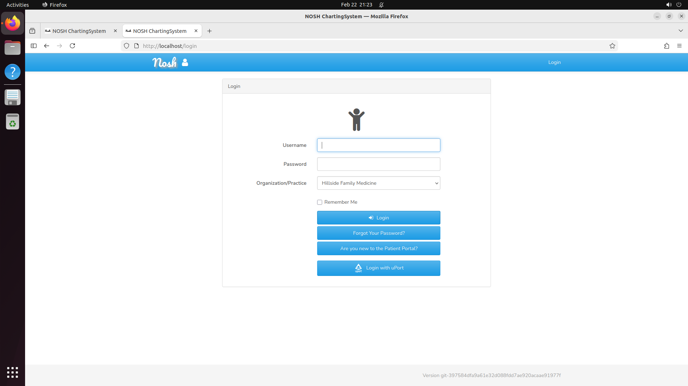

---

### 08: register_new_patient — Add New Patient Form

**File**: `08_register_new_patient_form.png` | **URL**: `http://localhost/add_patient`

**Task**: Register Garfield Lebsack (DOB: May 16, 1962, male, 58 Spruce St, Ludlow MA 01056, phone 413-555-9901)

Form with required fields: Last Name, First Name, DOB (date picker), Gender (dropdown). Save and Cancel buttons. Agent fills out the form and saves.

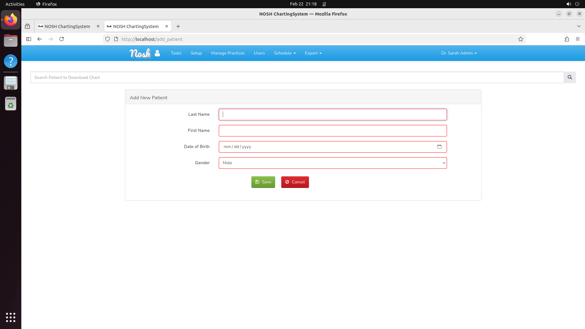

---

### 09: schedule_appointment — Schedule Page

**File**: `09_schedule_appointment.png` | **URL**: `http://localhost/schedule`

**Task**: Schedule an Office Visit on June 20, 2026 at 9:00 AM for Coreen Treutel (PID 14) with Dr. James Carter

Calendar page showing February 2026 with month navigation. "Select Provider" dropdown (should select Dr. James Carter after providers table fix). Agent navigates calendar to June 2026, selects date and time slot.

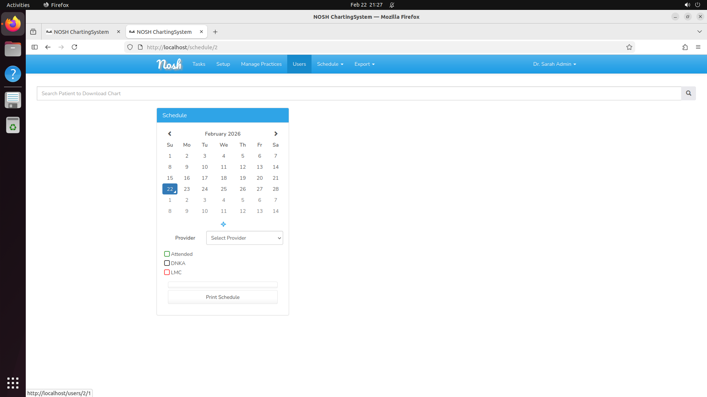

---

### 10: add_provider — Users Management Page

**File**: `10_add_provider_users.png` | **URL**: `http://localhost/users/2/1`

**Task**: Add new provider Dr. Maria Rodriguez (username: dr.rodriguez, email: maria.rodriguez@hillsidefm.local)

Users page listing active physicians. Shows "Dr. James Carter - demo_provider" with edit/remove/copy buttons. "Active Physician" dropdown filter and "+" add button visible.

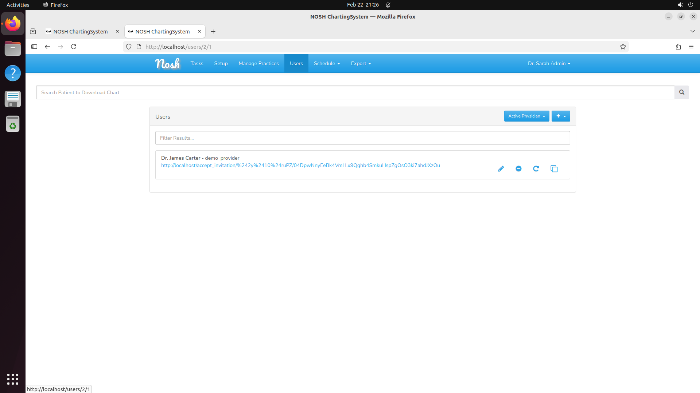

---

### 11: add_allergy — Allergies Section

**File**: `11_add_allergy.png` | **URL**: `http://localhost/allergies_list/list` (patient pid=16)

**Patient**: Myrtis Armstrong (DOB: April 8, 1985, pid=16, Female)
**Task**: Add Ibuprofen allergy, reaction "Skin rash and hives", severity "Moderate"

Allergies section showing "No known allergies." for Myrtis Armstrong (screenshot `11_add_allergy.png` taken while logged in as admin — the "+" button is **not visible** to admin). The "+" button is only visible to provider accounts. See screenshot `18a_allergies_list_with_plus_button.png` for the correct provider view showing the "+" button and "Active" dropdown in the top-right header.

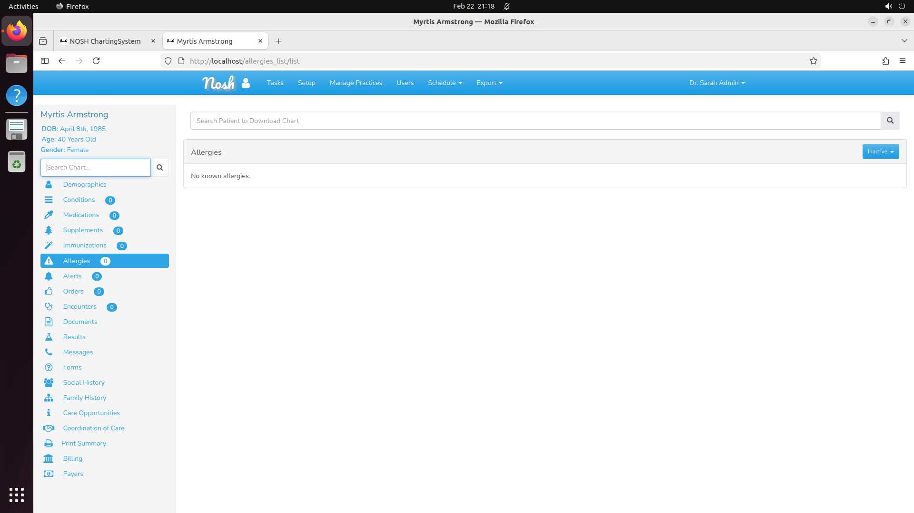

---

### 12: add_immunization — Immunizations Section

**File**: `12_add_immunization.png` | **URL**: `http://localhost/immunizations_list` (patient pid=12)

**Patient**: Malka Hartmann (DOB: November 26, 1994, pid=12, Female)
**Task**: Add Td (Tetanus/Diphtheria) vaccine, date Nov 15 2024, lot TD2024-892, manufacturer Sanofi

Immunizations section showing "None." for Malka Hartmann. The "+" button opens the add immunization form.

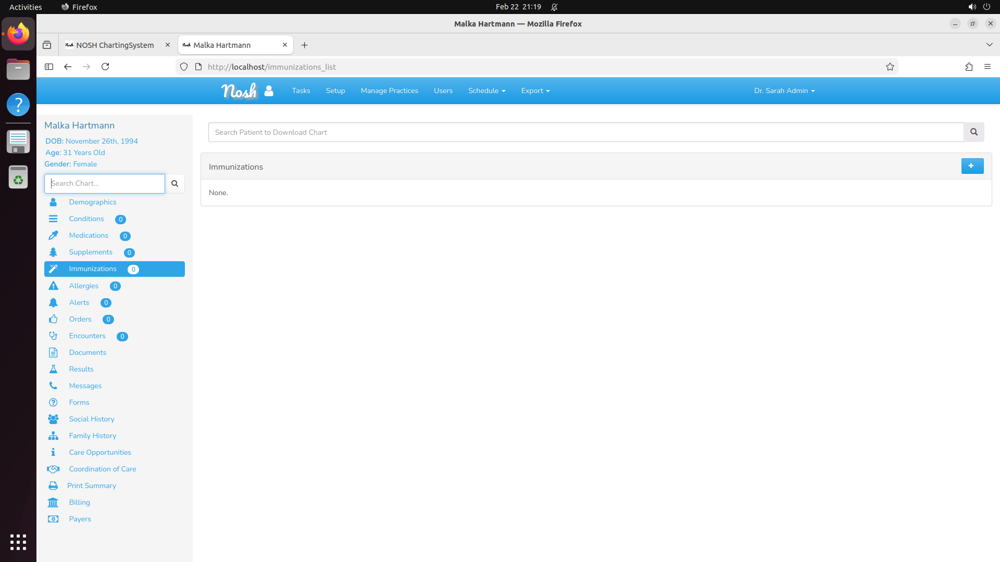

---

### 13: add_medical_problem — Conditions Section

**File**: `13_add_medical_problem.png` | **URL**: `http://localhost/conditions_list/active` (patient pid=17)

**Patient**: Arlie McClure (DOB: March 6, 1971, pid=17, Male)
**Task**: Add "Chronic Low Back Pain" (ICD-10: M54.5), onset February 3, 2014

Conditions section showing "None." for Arlie McClure. Active/inactive toggle and add button available.

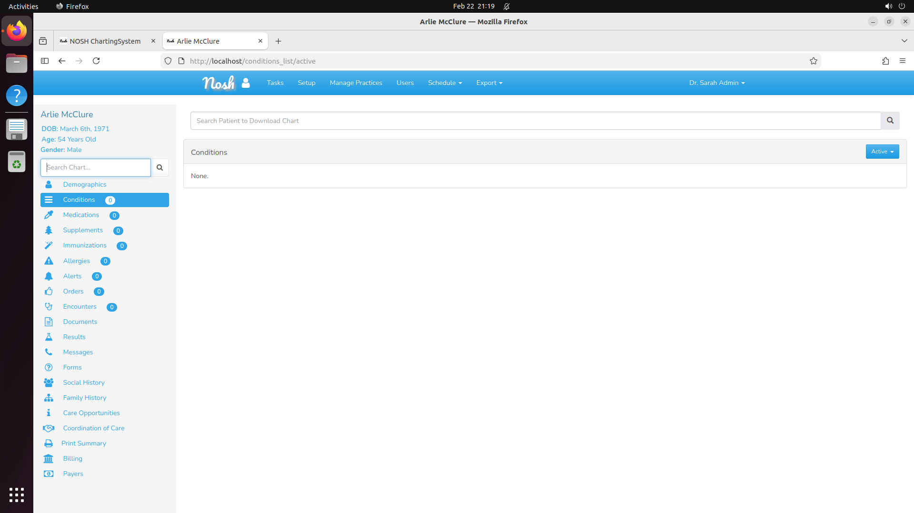

---

### 14: add_medication — Medications Section

**File**: `14_add_medication.png` | **URL**: `http://localhost/medications_list/active` (patient pid=11)

**Patient**: Hobert Wuckert (DOB: October 27, 2000, pid=11, Male)
**Task**: Prescribe Lisinopril 10mg once daily, qty 30 tablets, 0 refills

Medications section showing "None." for Hobert Wuckert. Active/inactive toggle and add button for entering prescriptions.

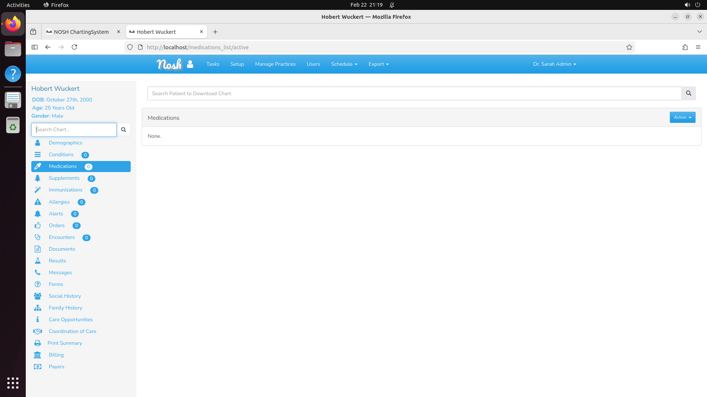

---

### 15: create_encounter — Encounters Section

**File**: `15_create_encounter.png` | **URL**: `http://localhost/encounters_list` (patient pid=18)

**Patient**: Crystal Schroeder (DOB: July 19, 1972, pid=18, Female)
**Task**: Create an Office Visit encounter dated today with Chief Complaint "Annual physical examination"

Encounters list showing "None." for Crystal Schroeder. Agent creates a new encounter with type "Office Visit" and today's date.

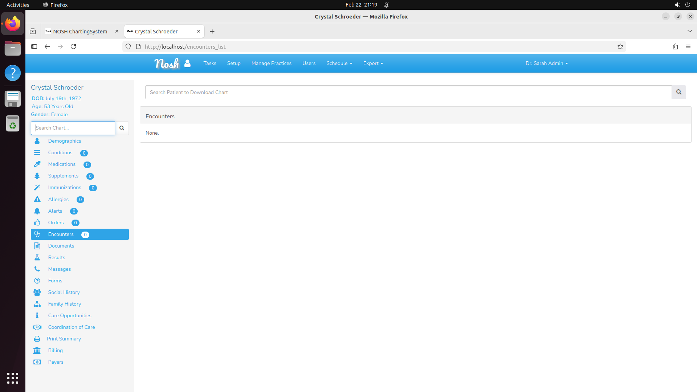

---

### 16: document_vitals — Patient Chart Overview

**File**: `16_document_vitals_chart.png` | **URL**: `http://localhost/patient` (patient pid=15)

**Patient**: Tracey Crona (DOB: July 2, 1981, pid=15, Male)
**Task**: Document vitals from October 19, 2023 encounter (BP 119/73, Pulse 70, Temp 98.2°F, Height 68 in, Weight 185 lbs)

Patient chart main page with full sidebar showing Demographics, Conditions, Medications, Immunizations, Allergies, Encounters, etc. Agent navigates to Encounters, creates a new Office Visit encounter dated October 19, 2023, then adds vitals within that encounter.

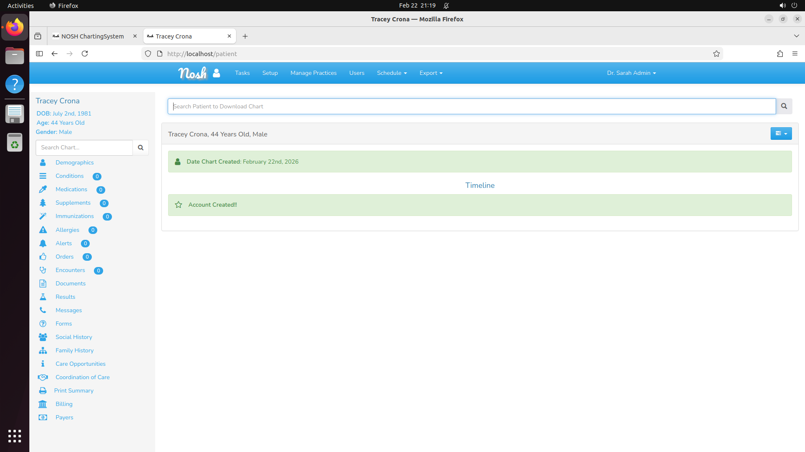

---

### 17: update_demographics — Demographics Page

**File**: `17_update_demographics.png` | **URL**: `http://localhost/demographics` (patient pid=19)

**Patient**: Luann Sanford (DOB: March 26, 1977, pid=19, Female)
**Task**: Update phone to 617-555-9283, email to luann.s.updated@healthmail.test, home address

Demographics page showing Luann Sanford's current info: address 71 Ash St, Greenfield MA 01301, phone 413-555-1019, email. Edit buttons for Name/Identity, Contacts, and Guardians sections.

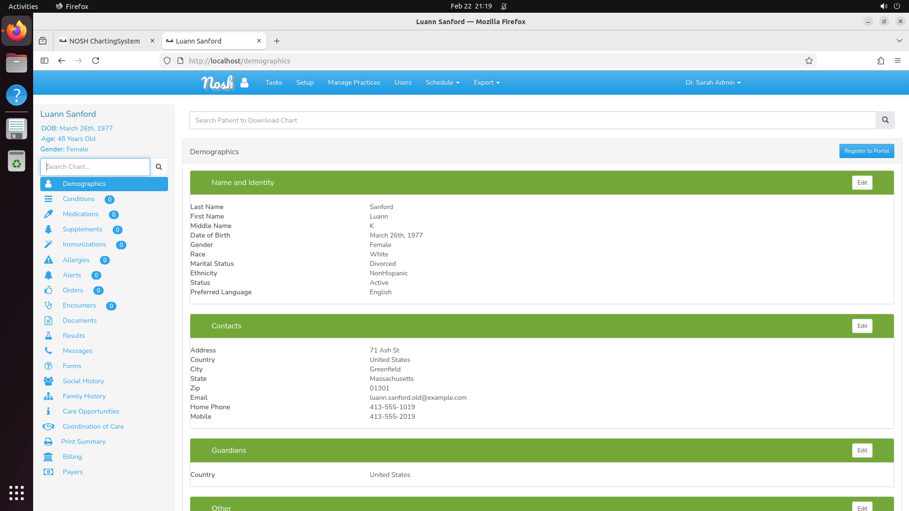

---

### 18a: add_allergy — Allergies List with Provider "+" Button

**File**: `18a_allergies_list_with_plus_button.png` | **URL**: `http://localhost/allergies_list/active` (patient pid=16, logged in as demo_provider)

Allergies list for Myrtis Armstrong showing "No known drug allergies." with the "+" button visible in the top-right header (requires provider login). The "Active" dropdown filter is to the left of "+". Clicking "+" opens the Add Allergy form.

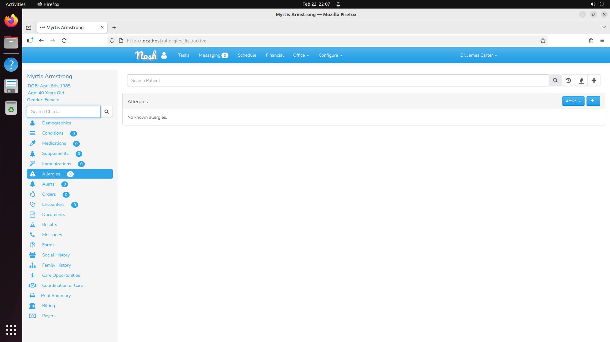

---

### 18: add_allergy — Add Allergy Form

**File**: `18_add_allergy_form.png` | **URL**: `http://localhost/chart_form/allergies/...`

Add Allergy form fields: Substance or Medication (required), Reaction (required), Severity (dropdown: Mild/Moderate/Severe), RXNorm ID (optional), Date Active (date picker, defaults to today), Notes (textarea), Sensitive Label (dropdown). Save (green) and Cancel (red) buttons.

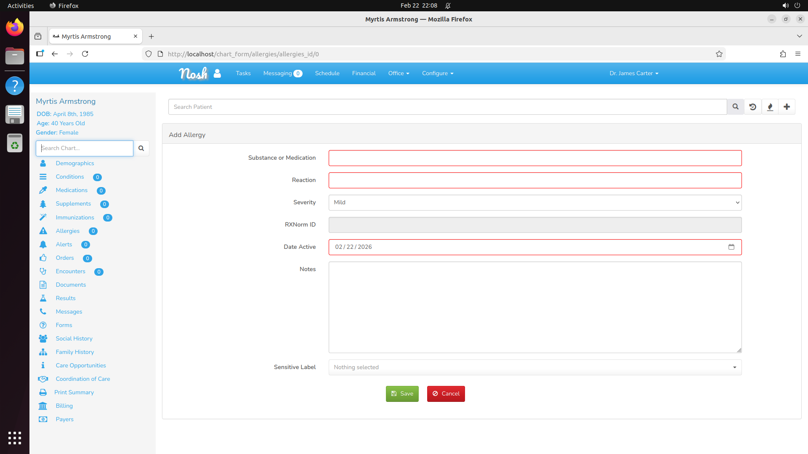

---

### 19: schedule_appointment — Appointment Creation Form

**File**: `19_appointment_form.png` | **URL**: `http://localhost/schedule/2` → click time slot → "Patient Appointment"

Appointment creation form fields: Search Patient (typeahead), Patient (display), Start Date (pre-filled from clicked slot), Start Time, End Time, Visit Type (dropdown: "Office Visit"), Reason (textarea), Notes/Tasks (textarea). Save (green) and Cancel (red) buttons. The calendar requires clicking "Patient Appointment" in the event-type dialog that appears after clicking a time slot.

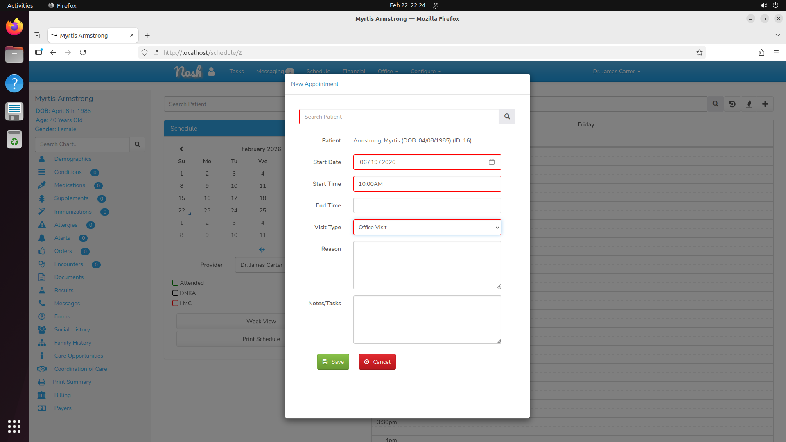

---

### 20: document_vitals — Encounter Creation Form

**File**: `20_create_encounter_form.png` | **URL**: `http://localhost/encounter_details/0` (from encounters list "+" button)

Encounter creation form fields: Provider (dropdown, pre-filled "Dr. James Carter"), Chief Complaint (text), Default Encounter Template (dropdown), Date of Service (datetime, defaults to now — change to desired date), Encounter Location (dropdown), Associated Appointment (dropdown), Provider Role (dropdown), Sensitive Label. Save (green) and Cancel (red) buttons.

**Note**: Date of Service can be set to a past date (e.g., October 19, 2023) for historical encounter documentation.

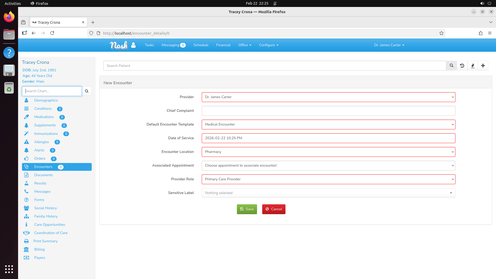

---

### 21: document_vitals — Vitals Entry Form

**File**: `21_vitals_form.png` | **URL**: `http://localhost/chart_form/vitals/{eid}/0` (from encounter Objective tab)

After saving the encounter, navigate to the "O" (Objective) tab and click the edit icon next to "Add Vital Signs". Vitals form fields: Weight (lbs), Height (inches), BMI (kg/m²), Temperature (F), Temperature Method (dropdown), Systolic BP (mmHg), Diastolic BP (mmHg), BP Position (dropdown), Pulse (bpm), Respirations (bpm), O2 Saturation (%), Notes (textarea). OK button at top right.

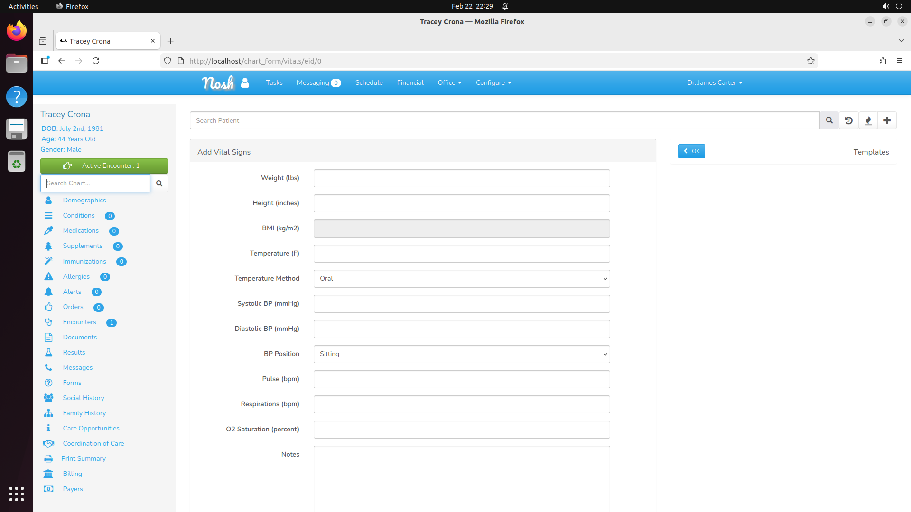

---

## Verified Patient Data

All 20 patients loaded from Synthea-generated SQL (PIDs 1-20), with sex stored as `'m'`/`'f'` (single char lowercase):

| PID | Name | DOB | Sex | Task |
|-----|------|-----|-----|------|
| 11 | Hobert Wuckert | 2000-10-27 | m | add_medication |
| 12 | Malka Hartmann | 1994-11-26 | f | add_immunization |
| 14 | Coreen Treutel | 1990-07-20 | f | schedule_appointment |
| 15 | Tracey Crona | 1981-07-02 | m | document_vitals |
| 16 | Myrtis Armstrong | 1985-04-08 | f | add_allergy |
| 17 | Arlie McClure | 1971-03-06 | m | add_medical_problem |
| 18 | Crystal Schroeder | 1972-07-19 | f | create_encounter |
| 19 | Luann Sanford | 1977-03-26 | f | update_demographics |

## HTTP Verification

- `GET /login` → 200 OK (login form)
- `POST /login` with `username=admin, password=Admin1234!` → 302 → dashboard
- `GET /` (dashboard) → 200 OK
- `GET /add_patient` → 200 OK
- `GET /patient` (with patient set) → 200 OK
- `GET /demographics` (with patient set) → 200 OK
- `GET /allergies_list/list` → 200 OK
- `GET /medications_list/active` → 200 OK
- `GET /immunizations_list` → 200 OK
- `GET /conditions_list/active` → 200 OK
- `GET /encounters_list` → 200 OK
- `GET /schedule` → 200 OK
- `GET /users/2/1` → 200 OK (shows Dr. James Carter)

## Database Tables Verified

- `users`: admin (group_id=1), demo_provider (group_id=2)
- `providers`: demo_provider (id=2, npi=1234567890, specialty=Family Medicine)
- `groups`: admin(1), provider(2), assistant(3), billing(4), patient(100)
- `practiceinfo`: Hillside Family Medicine, version=2.0.0, weekends=0, minTime=08:00, maxTime=18:00, timezone=America/New_York, mon-fri 08:00-17:00
- `practiceinfo_plus`: practice_id=1 (required for CheckInstall middleware)
- `calendar`: 'Office Visit' (duration=30, active='y') — required for appointment booking
- `demographics`: 20 patients (PIDs 1-20) with sex as 'm'/'f'
- Task tables clean (empty at start): allergies, issues, rx, schedule, vitals, immunizations

## Bugs Found and Fixed During Interactive Testing

### Bug 1: Sex Field Mismatch → demographics 500 error
- **Symptom**: `GET /demographics` → HTTP 500 "Undefined index: Male"
- **Root cause**: `patients.sql` stored `sex='Male'/'Female'`; NOSH `array_gender()` expects `'m'/'f'`
- **Fix**: `data/patients.sql` updated to use `'m'` and `'f'` (sed replacement)

### Bug 2: Missing Scans Directory → demographics 500 error
- **Symptom**: `GET /demographics` → HTTP 500 "mkdir(): No such file or directory" in `get_scans()`
- **Root cause**: `get_scans()` calls `mkdir(Storage::path('scans/1'))` but parent `/var/www/nosh/storage/app/scans` missing
- **Fix**: Added to `scripts/setup_nosh.sh`: `docker exec nosh-app mkdir -p /var/www/nosh/storage/app/scans/1`

### Bug 3: Provider Not Listed in Users Page → users page shows "None."
- **Symptom**: `/users/2/1` shows "None." even though demo_provider user exists
- **Root cause**: The users query for type=2 (providers) JOINs `users` with `providers` table; demo_provider had no row in `providers`
- **Fix**: Added to `scripts/setup_nosh.sh`: INSERT demo_provider into `providers` table

### Bug 4: Firefox Autocomplete Interference → login failure
- **Symptom**: Password field pre-filled with wrong cached value from earlier failed attempts
- **Root cause**: Firefox form history caching login attempts
- **Fix**: Added `browser.formfill.enable=false` and `signon.generation.enabled=false` to Firefox user.js in `scripts/setup_nosh.sh`

### Bug 5: Admin Cannot Add Clinical Data → "+" button hidden for admin
- **Symptom**: `/allergies_list/list` (and all other chart sections) show no "+" add button when logged in as admin
- **Root cause**: NOSH restricts clinical data entry to group_id=2 (provider), group_id=3 (assistant), group_id=100 (patient); admin (group_id=1) can view charts but not add entries
- **Fix**: All 8 clinical task descriptions updated to use `demo_provider / Provider1234!` instead of `admin / Admin1234!`

### Bug 6: FullCalendar Blank / "Closed" Blocks → schedule page non-functional
- **Symptom**: `/schedule/2` calendar rendered with "Closed" blocks covering all time slots; no clickable appointment slots
- **Root cause**: `practiceinfo` table had NULL for `weekends`, `minTime`, `maxTime`, `timezone`, `mon_o/c` through `fri_o/c`; `calendar` table was empty (no visit types)
- **Fix**: Added to `scripts/setup_nosh.sh`: UPDATE practiceinfo with calendar fields (08:00-17:00 Mon-Fri, America/New_York); INSERT 'Office Visit' into calendar table
