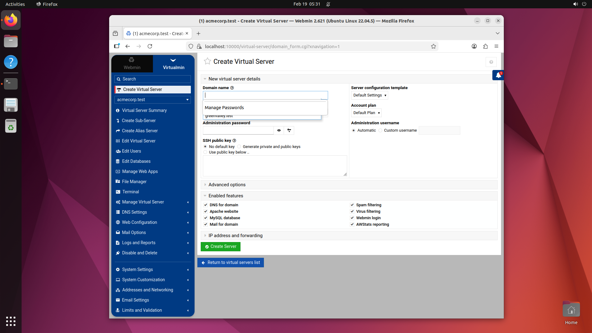
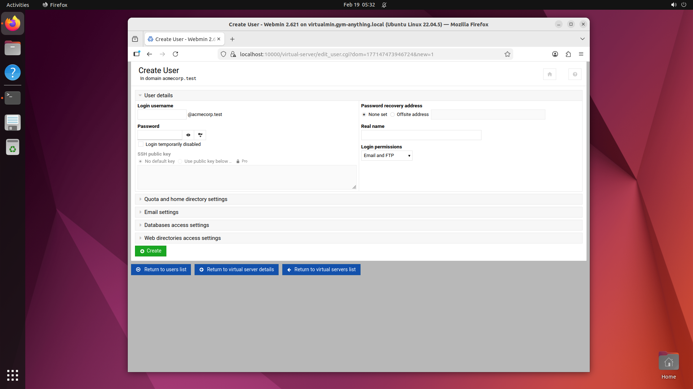
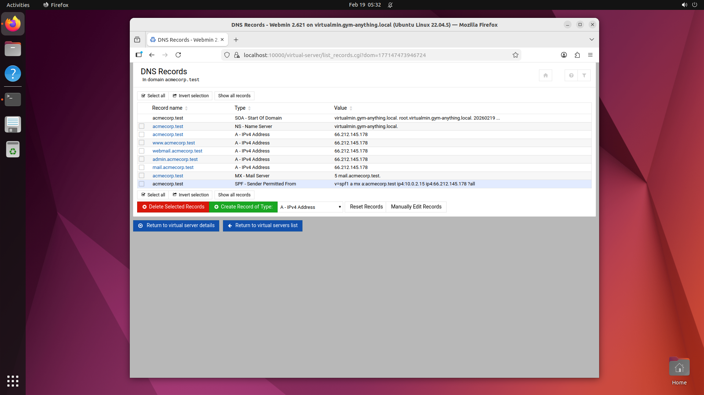
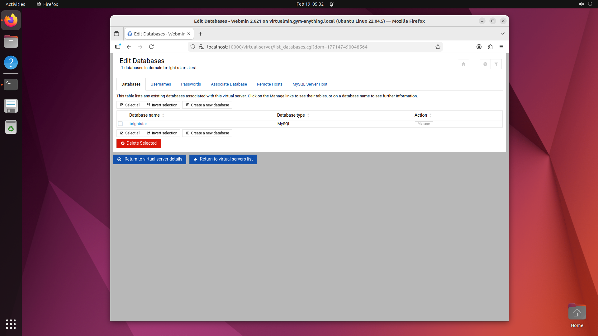
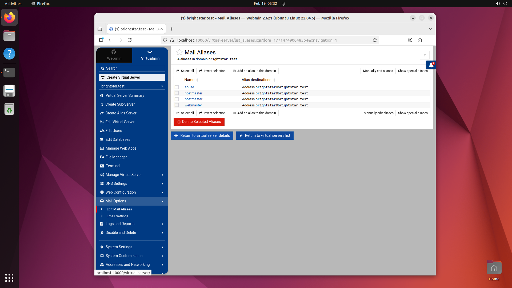

# Virtualmin Environment — Evidence Documentation

This folder contains screenshots verifying the task start states for each task in the Virtualmin environment. All screenshots were captured from a live QEMU VM running Virtualmin GPL 7.x / Webmin 2.621 on Ubuntu 22.04 LTS.

## Environment Details

- **Application**: Virtualmin GPL (web hosting control panel)
- **Webmin version**: 2.621
- **OS**: Ubuntu Linux 22.04.5
- **Resolution**: 1920x1080
- **Browser**: Firefox (snap)
- **Port**: 10000 (HTTPS, self-signed cert)
- **Admin credentials**: root / GymAnything123!

## Pre-seeded Data

### Virtual Servers (Domains)
| Domain | Purpose | Password |
|--------|---------|----------|
| acmecorp.test | Technology company | AcmePwd789! |
| brightstar.test | Media company | BrightPwd456! |
| greenvalley.test | Agricultural business | GreenPwd123! |

### Email Users
- **acmecorp.test**: admin, info, sales, support
- **brightstar.test**: admin, info, editor
- **greenvalley.test**: admin, orders

### Email Aliases (brightstar.test)
- abuse → brightstar@brightstar.test
- hostmaster → brightstar@brightstar.test
- postmaster → brightstar@brightstar.test
- webmaster → brightstar@brightstar.test

### Databases
- **acmecorp**: MySQL database (default virtual server db)
- **brightstar**: MySQL database (default virtual server db)
- **sakila**: Full Sakila sample database (1000 films, 200 actors, 599 customers)

### DNS Records (acmecorp.test)
SOA, NS, A (main + www + webmail + admin + mail), MX, SPF records

### Website Content
- acmecorp.test: Bootstrap 5 Album template (real HTML, MIT license)

### Emails
- SpamAssassin public corpus emails (CC0/public domain) in Maildirs for admin/info users

## Task Start States

### Task 1: create_virtual_server
**URL**: `https://localhost:10000/virtual-server/domain_form.cgi`

Shows the "Create Virtual Server" form with fields for domain name, server configuration template, account plan, admin username/password, and enabled features (DNS, Apache website, MySQL database, Mail, Spam/Virus filtering, etc.).



---

### Task 2: create_email_account
**URL**: `https://localhost:10000/virtual-server/edit_user.cgi?dom=<ACMECORP_ID>&new=1`

Shows the "Create User in domain acmecorp.test" form with fields for login username (@acmecorp.test suffix pre-filled), password, real name, login permissions (Email and FTP), and collapsed sections for quota, email settings, database access.



---

### Task 3: add_dns_record
**URL**: `https://localhost:10000/virtual-server/list_records.cgi?dom=<ACMECORP_ID>`

Shows the "DNS Records in domain acmecorp.test" page listing 9 existing records (SOA, NS, A records for main/www/webmail/admin/mail, MX, SPF). Has "Create Record of Type" button for adding new records.



---

### Task 4: create_mysql_database
**URL**: `https://localhost:10000/virtual-server/list_databases.cgi?dom=<BRIGHTSTAR_ID>`

Shows the "Edit Databases — 1 databases in domain brightstar.test" page with the existing `brightstar` MySQL database listed. Has tabs for Databases, Usernames, Passwords, Associate Database, Remote Hosts, MySQL Server Host. Has "Create a new database" option.



---

### Task 5: create_email_alias
**URL**: `https://localhost:10000/virtual-server/list_aliases.cgi?dom=<BRIGHTSTAR_ID>`

Shows the "Mail Aliases — 4 aliases in domain brightstar.test" page listing 4 existing system aliases (abuse, hostmaster, postmaster, webmaster → brightstar@brightstar.test). Has "Add an alias to this domain" button.



---

## Key Technical Notes

### Virtualmin 8.x URL Format
Virtualmin 8.x uses **numeric domain IDs** (not domain names) in URLs. Domain names in query parameters (e.g., `?dom=acmecorp.test`) cause "Server no longer exists!" errors. Use the ID instead: `?dom=177147473946724`.

The domain ID can be retrieved dynamically:
```bash
virtualmin list-domains --domain acmecorp.test --id-only
```

### Correct CGI Names (Virtualmin 8.x)
| Task | Correct CGI | Wrong CGI (don't use) |
|------|------------|----------------------|
| Create Virtual Server | `domain_form.cgi` | `edit_domain.cgi?new=1` |
| DNS Records | `list_records.cgi` | `list_dns.cgi` (doesn't exist) |
| MySQL Databases | `list_databases.cgi` | `list_dbs.cgi` (doesn't exist) |
| Email Aliases | `list_aliases.cgi` | — (correct) |
| Create User | `edit_user.cgi?dom=ID&new=1` | `edit_user.cgi?dom=name&new=1` |

### Webmin CSRF Protection
By default, Webmin blocks direct URL navigation (no Referer header). Fix:
- Set `referers_none=0` in `/etc/webmin/config` AND `/etc/webmin/miniserv.conf`
- Restart Webmin after changing

### Login Form Coordinates (1920x1080)
- Username field: (993, 384) [VG scale 1280x720: 662, 256]
- Password field: Tab from username
- Sign In button: (993, 511) [VG scale 1280x720: 662, 341]

### SSL Warning Dismissal
- "Advanced..." button: (1318, 705)
- "Accept the Risk and Continue": (1251, 1008)
