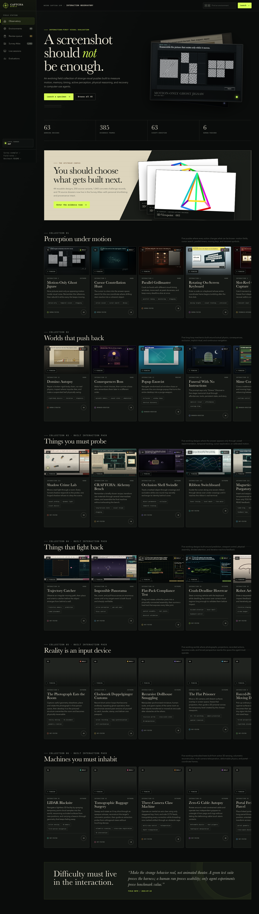

# CAPTCHA Bench Dashboard

The dashboard is the local visual control plane for Weird CAPTCHA Gym. Its catalog is generated from 65 real environment folders: 63 evidence-backed built designs and 2 rejected archive pilots, with zero concept or scaffold cards. Screenshots, task identities, validation evidence, VNC launches, and evaluation commands all refer to those same environment objects. All twenty Pack III–VI selections and all historical Incubator selections are now built; together, 43 formerly queued or selected mechanics were promoted only after their folders, verifiers, evidence, and launch contracts existed.

The **Survey Atlas** is the upstream research layer. It exposes 1,411 browseable records in four honest layers: 44 reusable cross-source designs, 250 exact source variants, 1,043 concrete challenge/evidence records, and 74 source dossiers. Those records are backed by 19,168 local files, including 12,710 image assets and 1,788 files in curated `media/` folders. It keeps source provenance, item-level evidence, personal curation, and benchmark lineage separate from implemented environments.



## Start it

From the repository root:

```bash
PYTHONPATH=src python benchmarks/weird_captcha_gym/dashboard/server.py --open --runner avf
```

Then visit <http://127.0.0.1:8767>. The server binds to localhost by default.

The `avf` runner is the normal choice on Apple Silicon. `qemu`, `qemu_native`, `docker`, and `local` are also accepted when the corresponding Gym-Anything runner is configured.

## Product surfaces

- **Observatory** — a screenshot-first overview of the strongest interaction mechanics and benchmark principles.
- **Environments** — a searchable, filterable collection of 63 built candidates plus the 2 rejected pilots retained as an honest archive.
- **Review queue** — a human acceptance ledger showing pending, approved, and revision-requested built environments, with search and status lanes.
- **Environment dossier** — evidence filmstrip, agent-facing instruction, verifier state, task identity, launch controls, and an approval/revision desk with decision history.
- **Survey Atlas / Designs** — 44 deduplicated interaction ideas from the cross-source mechanic index.
- **Survey Atlas / Source variants** — 250 exact levels, microgames, challenge states, generator families, source components, game screens, and modifiers.
- **Survey Atlas / Concrete instances** — a server-paginated browser over 983 ground-truth challenge records and 60 public ViRC captures whose local answer keys are unavailable.
- **Mechanic and instance dossiers** — source evidence, exact prompts, composed visual assets, structured ground truth when present, benchmark descendants, comparison, and personal curation.
- **Source dossier** — the full provenance record, extraction notes, original URL, licensing policy, related designs/variants/instances, implemented descendants, and paginated browsing across every collected artifact.
- **Live sessions** — real Gym-Anything workers with boot state, VNC address/password, logs, reconnect, and teardown.
- **Evaluations** — safe command previews by default, with an explicit opt-in to execute the existing `gym_anything.cli benchmark` path.

One-click launch starts an isolated worker, calls the real environment `reset`, waits for `SessionInfo`, and can hand the resulting endpoint to a configured VNC viewer. The dashboard does not emulate a VNC lifecycle or duplicate benchmark setup logic. It allows at most two simultaneous sessions and prevents duplicate launches of the same environment. Scripted browser evidence exists for all 63 built designs; direct VNC human calibration still remains pending for many of them.

## Atlas data and curation

Atlas reads the sibling `research/collection/` corpus. Set `CAPTCHA_BENCH_RESEARCH_ROOT` when that corpus lives elsewhere. The multi-gigabyte source archive is intentionally not duplicated inside the `gym-anything` package; a standalone checkout without it reports Atlas as unavailable while keeping the environment catalog, reviews, sessions, and evaluations operational. Its layered index is assembled from:

- 44 entries in the deduplicated cross-source mechanic index;
- 167 previously extracted source variants: 48 Neal.fun levels, 22 CaptchaWare microgames, 50 Captcha RPG states, 27 NextGen families, and 20 OpenCaptchaWorld families;
- 83 additional variants enumerated only from explicit local manifests or source files: 28 CAPTCHA Royale generators, 14 Nicholas Dejesse components, 14 SimpleCaptcha grids, 16 Evil CAPTCHA screens, and 11 Henry Amatsu categories/modifiers;
- 520 NextGen and 463 OpenCaptchaWorld ground-truth challenge records (configuration-only rows are not presented as instances);
- 60 ViRC public examples with transcribed prompts and an explicit `ground_truth unavailable` state.

This count deliberately does not equate files with CAPTCHAs. A single challenge may require a reference image, sixteen cells, nine jigsaw pieces, or several animated options. Those remain attached assets of one challenge record. Sources that advertise a count without enumerating the individual challenges remain source-level claims; Atlas does not manufacture placeholder cards to satisfy the claim.

Cards and dossiers never copy artifacts into dashboard-owned placeholder data. `/atlas-media/` resolves to the collected source tree with path-containment checks; executable/text-like formats are served as inert downloads, while images, audio, video, and PDFs remain inspectable. Large archives are streamed instead of buffered in memory. Artifact APIs are paginated so multi-gigabyte source corpora do not become giant page payloads.

Personal decisions are stored atomically in `research/collection/atlas-curation.json` as `shortlisted`, `maybe`, `rejected`, or `unreviewed`, with an optional note and an explicit incubator marker. “Promote to incubator” records build intent only—it does not fabricate an environment folder, task, verifier, or evidence result.

## Human review ledger

Built environments have a separate acceptance workflow because scripted verification is not human usability evidence. The **Review queue** starts with all 63 built designs pending. From an environment dossier, a reviewer can:

- mark the interaction **Approved**;
- mark it **Needs revision**, which requires a concrete feedback note;
- return it to **Pending review** without erasing its decision history.

Decisions are written atomically to `research/collection/environment-reviews.json`. Each record retains its current status, current note, timestamps, and the last 100 decision-history entries. The two rejected infrastructure pilots are not reviewable and never enter the denominator. Set `CAPTCHA_BENCH_REVIEW_PATH` or pass `--review-path /path/to/reviews.json` to isolate or relocate the ledger.

## Verification

Interaction V and VI promotion is tied to `evidence/incubator_batch_eight_v1/summary.json` and `evidence/incubator_batch_nine_v1/summary.json`. Catalog tests require all five expected mechanics in each summary and require browser, server, direct-grader, and exported-verifier success before the dashboard may report 63 browser-verified builds.

Run the backend and catalog tests:

```bash
PYTHONPATH=src python -m pytest tests/test_weird_captcha_dashboard.py -q
```

Run the dashboard in one terminal:

```bash
PYTHONPATH=src python benchmarks/weird_captcha_gym/dashboard/server.py \
  --port 8877 \
  --runner avf \
  --review-path /tmp/captcha-dashboard-smoke-reviews.json
```

Then run the browser smoke and regenerate dashboard evidence from another terminal:

```bash
python benchmarks/weird_captcha_gym/tools/smoke_dashboard_ui.py \
  --base-url http://127.0.0.1:8877 \
  --exercise-reviews
```

The smoke covers the 65/63/2 catalog totals, persistent review approval/revision/history, the absence of concept/scaffold cards, five launchable Interaction V cards, five launchable Interaction VI cards, evidence-gallery swaps, evaluation command preview, session states, the command palette, all four Atlas layers, server-paginated instance filtering, structured ground truth, source/media filtering, mechanic and source dossiers, the comparison tray, and responsive navigation. It also leaves DOM identity and focus probes in place across review saves, polling, and Atlas filter operations, guarding against destructive refreshes and screen flicker. Captures are written to [`evidence/`](evidence/).

With a configured runner, exercise the real VNC protocol and teardown path against an already-running dashboard:

```bash
python benchmarks/weird_captcha_gym/tools/smoke_dashboard_live_vnc.py \
  --base-url http://127.0.0.1:8767
```

This opt-in smoke clicks the actual one-click launch control, waits for `SessionInfo`, verifies the forwarded port answers with an RFB/VNC banner, proves the live card remains mounted while its uptime advances, records the live-session UI, stops the environment, and confirms the port closes.

## Architecture

```text
63 built folders + task.json + evidence images ─────┐
2 rejected archive folders ─────────────────────────┤
                                                     ▼
                                                catalog.py
                                      ┌──────────────┴──────────────┐
                                      ▼                             ▼
                             screenshot gallery            environment identity
                                                                     │
                                                           ┌─────────┴─────────┐
                                                           ▼                   ▼
                                                   session_worker.py    benchmark CLI
                                                           │                   │
                                                           ▼                   ▼
                                                   SessionInfo / VNC    evaluation process

research/collection/catalog.jsonl ───────────────┐
mechanic index + normalized source extractions ──┤
19,168 source artifacts + extraction notes ──────┤
atlas-curation.json ──────────────────────────────┘
                                                   ▼
                                                atlas.py
                                      ┌────────────┼─────────────┐
                                      ▼            ▼             ▼
                         44 designs  250 variants  1,043 instances  74 dossiers
                               │           │              │             │
                               └──────── explicit provenance ────────────┘
                                                │
                                  explicit source anchors ──► environment catalog

research/collection/environment-reviews.json ──► reviews.py ──► review queue + dossier desk
```

The backend intentionally uses the Python standard library. The frontend is dependency-free HTML, CSS, and JavaScript so the dashboard can boot in a benchmark checkout without a package-install or build step.

See [`RESEARCH.md`](RESEARCH.md) for the product research and design decisions behind this surface.
